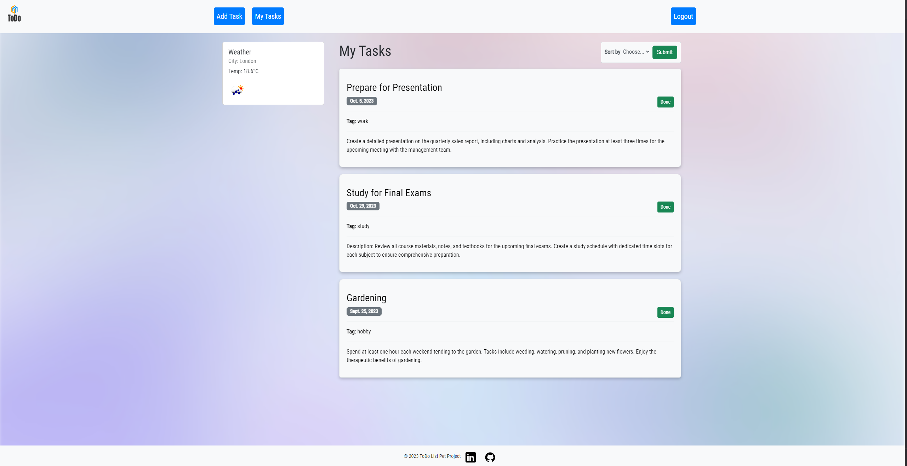
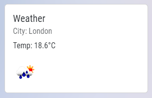
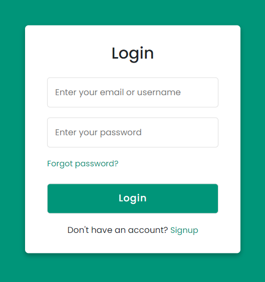
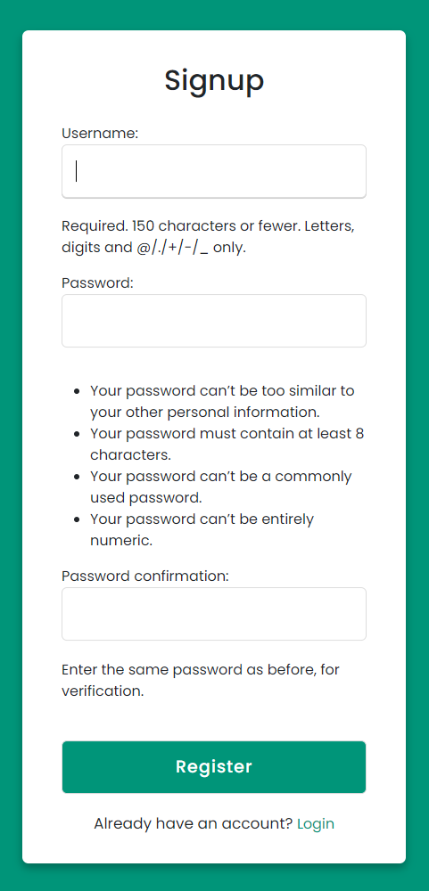
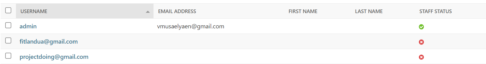
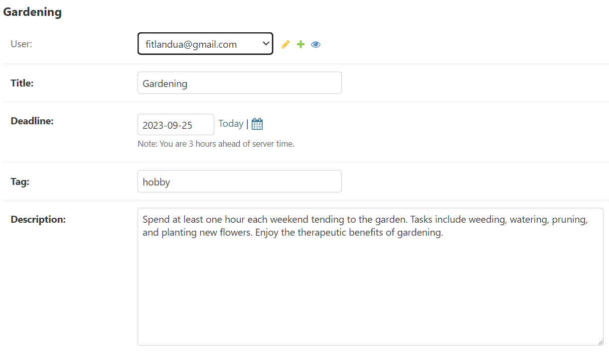
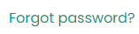
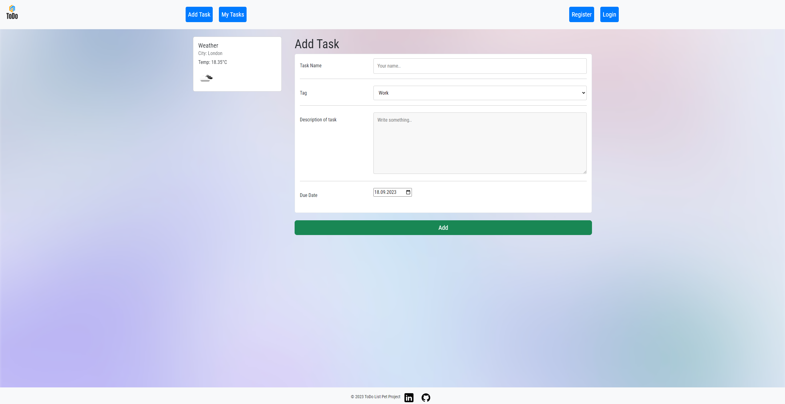
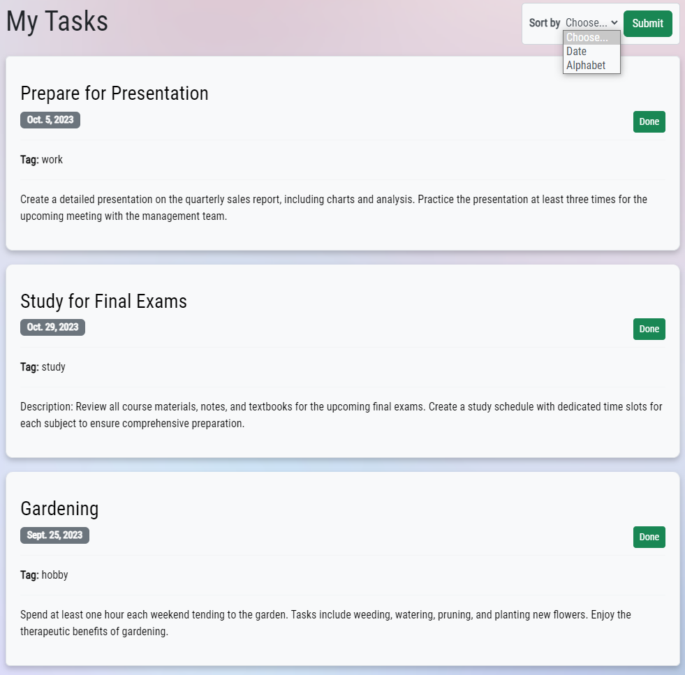

# ToDo Website
---
This is my first web project, undertaken for educational purposes to facilitate a 
deeper understanding of Django. The website I've developed serves as a practical platform 
for honing my skills.

## Technology Stack
* Python/Django/Django-ORM
* PostgreSQL
* API
* HTML/CSS/Bootsrap

---
In this project, we're using a PostgreSQL database and a one-to-many model to handle user 
logins and registrations. This approach helps make our user management system more secure and efficient.

# Website

This website offers users the ability to add tasks with associated deadlines, tags, and descriptions. 
Additionally, it provides a simple mechanism for task deletion upon completion. Furthermore, 
the website have a real-time weather feature, displaying weather information based on the user's 
IP address. In the event the IP address is inaccessible, the weather data defaults to London's conditions.

# API
---
In this project, we've integrated an API to display real-time weather information on the website.

# Login and Registration
---

## Login page

## Register page
This logic were realised in a separate application members, we were using ready-made form from django.contrib.auth.forms.
Every user have his own tasks that no one could see, and it represents in database like this

And every task have own user

# Reset Password
---

When you are forgot the password you can reset it by entering email, and on this email you'll get the 
letter with a link resetting password, this was made by using ready-made views from django.contrib.auth.

# Create Task, add to DB
---

We have a form that allows us to input information, which we can then submit to the server as a POST request. 
Our view gathers all the data from this request and stores it in the database.

# Sorting Tasks
---

We're implementing straightforward sorting that using ORDER BY on the main page 
based on the category selected by the user.

